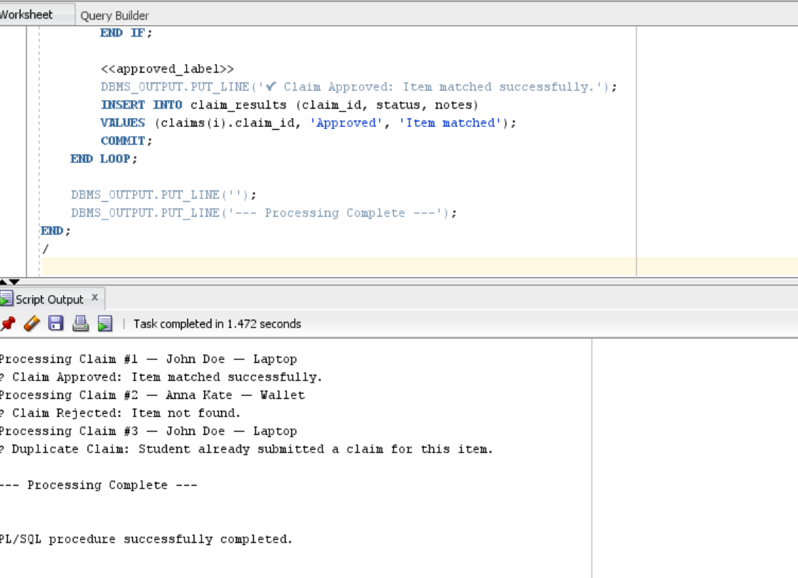

**Student Name:** Akariza GASANA Leslie 

**ID:** 27413  
  

---
# PL/SQL  Project – Lost Item Claim Processing System

## Project Overview
This PL/SQL project simulates how a **university lost-and-found office** manages student claims for lost items.  
The system records student name, item claimed, and item description, then processes claims to determine whether they are valid, duplicates, or invalid.

The project demonstrates three key PL/SQL concepts:

- **Collections (Nested Table)** – to store multiple claims  
- **Records (User-defined composite type)** – to group claim details  
- **GOTO statements (Control flow handling)** – to skip or handle special cases  

---

##  Problem Statement
In a busy university environment, the lost-and-found office receives multiple claim submissions.  

Each claim contains:

- Claim ID  
- Student Name  
- Item Name  
- Item Description  

The system does the following:

1. Use a **collection** to store all claims  
2. Use a **record** to store each claim’s details  
3. Detect duplicates  
4. Skip processing for invalid items using a **GOTO statement**  
5. Print full claim processing results  

---

##  Concepts Demonstrated

###  1. Nested Table Collection
Used to store multiple claims:

```plsql
TYPE claim_tab IS TABLE OF claim_rec;
claims claim_tab;
```
### 2. Record

Used to group claim details:
```
TYPE claim_rec IS RECORD (
    claim_id NUMBER,
    student_name VARCHAR2(100),
    item_name VARCHAR2(50),
    description VARCHAR2(200)
);
```
 ### 3. GOTO Statement

Used to jump to labels for duplicates or invalid items:

```
GOTO not_found_label;
GOTO duplicate_label;
```
 ### Full SQL Scripts
```
1. Create Tables
-- Table: lost_items 
CREATE TABLE lost_items (
    item_id NUMBER GENERATED BY DEFAULT AS IDENTITY PRIMARY KEY,
    item_name VARCHAR2(50) NOT NULL,
    description VARCHAR2(200)
);

-- Table: student_claims
CREATE TABLE student_claims (
    claim_id NUMBER GENERATED BY DEFAULT AS IDENTITY PRIMARY KEY,
    student_name VARCHAR2(100) NOT NULL,
    item_name VARCHAR2(50) NOT NULL,
    description VARCHAR2(200)
);

-- Table: claim_results
CREATE TABLE claim_results (
    result_id NUMBER GENERATED BY DEFAULT AS IDENTITY PRIMARY KEY,
    claim_id NUMBER REFERENCES student_claims(claim_id),
    status VARCHAR2(20),
    notes VARCHAR2(200)
);
```
### Full PL/SQL Code
```
SET SERVEROUTPUT ON;

DECLARE
    TYPE claim_rec IS RECORD (
        claim_id NUMBER,
        student_name VARCHAR2(100),
        item_name VARCHAR2(50),
        description VARCHAR2(200)
    );

    TYPE claim_tab IS TABLE OF claim_rec;
    claims claim_tab;

    matched_count NUMBER;
    duplicate_found BOOLEAN;

BEGIN
    SELECT claim_id, student_name, item_name, description
    BULK COLLECT INTO claims
    FROM student_claims;

    DBMS_OUTPUT.PUT_LINE('--- Processing Claims ---');
    DBMS_OUTPUT.PUT_LINE('');

    FOR i IN 1 .. claims.COUNT LOOP
        duplicate_found := FALSE;
        DBMS_OUTPUT.PUT_LINE('Processing Claim #' || claims(i).claim_id || ' — ' ||
                             claims(i).student_name || ' — ' || claims(i).item_name);

        FOR j IN 1 .. i-1 LOOP
            IF claims(j).student_name = claims(i).student_name
               AND claims(j).item_name = claims(i).item_name THEN
                duplicate_found := TRUE;
                GOTO duplicate_label;
            END IF;
        END LOOP;

        SELECT COUNT(*) INTO matched_count
        FROM lost_items
        WHERE LOWER(item_name) = LOWER(claims(i).item_name);

        IF matched_count = 0 THEN
            GOTO not_found_label;
        ELSE
            GOTO approved_label;
        END IF;

        <<duplicate_label>>
        IF duplicate_found THEN
            DBMS_OUTPUT.PUT_LINE('⚠ Duplicate Claim: Student already submitted a claim for this item.');
            INSERT INTO claim_results (claim_id, status, notes)
            VALUES (claims(i).claim_id, 'Duplicate', 'Duplicate claim detected');
            COMMIT;
            CONTINUE;
        END IF;

        <<not_found_label>>
        IF matched_count = 0 THEN
            DBMS_OUTPUT.PUT_LINE('✖ Claim Rejected: Item not found.');
            INSERT INTO claim_results (claim_id, status, notes)
            VALUES (claims(i).claim_id, 'Rejected', 'Item not found');
            COMMIT;
            CONTINUE;
        END IF;

        <<approved_label>>
        DBMS_OUTPUT.PUT_LINE('✔ Claim Approved: Item matched successfully.');
        INSERT INTO claim_results (claim_id, status, notes)
        VALUES (claims(i).claim_id, 'Approved', 'Item matched');
        COMMIT;
    END LOOP;

    DBMS_OUTPUT.PUT_LINE('');
    DBMS_OUTPUT.PUT_LINE('--- Processing Complete ---');
END;
/
```
### Output 


### Conclusion

This project clearly demonstrates:

How to use Nested Table collections to store multiple claims

How to group related data using Records

How to control program flow with GOTO statements


